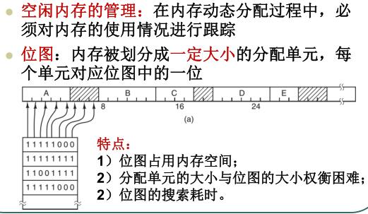
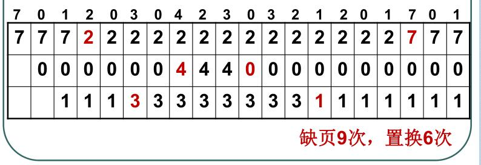

# 1、分页存储管理方式原理

内存管理单元(MMU)管理着地址单元和物理单元的转换, 其中的页表(Page Table)储存着页(程序地址空间)和页框(物理内存空间)的映射表.

一个虚拟地址分成两个部分, 一部分储存页面号, 一部分储存偏移量.

下图的页表存放着 16 个页，这 16 个页需要用 4 个比特位来进行索引定位。
例如对于虚拟地址（0010 000000000100），前 4 位是存储页面号 2，读取表项内容为（110 1），页表项最后一位表示是否存在于内存中，1 表示存在。
后 12 位存储偏移量。这个页对应的页框的地址为 （110 000000000100）。

# 2、覆盖技术、交换技术
交换技术: 把一个进程完整调入内存, 使该进程运行一段时间, 然后把它调回磁盘

覆盖技术: 程序按照逻辑分段

虚拟技术: 使程序在只有一部分被调入内存的情况下运行

交换技术和覆盖技术的区别

共同点: 进程的程序和数据主要放在外存, 当前需要执行的部分放在内存, 内外存之间进行信息交换.

不同点: 交换技术不要求用户给出程序段之间的覆盖结构;交换发生在进程或者作业之间,
而覆盖发生在同一进程或作业内;覆盖只能覆盖那些与覆盖段无关的程序段.
# 3、物理内存管理方式

记录哪些内存空闲和已经使用

位图

链表

链表回收

# 4、可变分区存储管理方式原理及动态分区管理常用内存分配算法

# 5、页表及多级页表、TLB、页的大小

页表(Page Table)储存着页(程序地址空间)和页框(物理内存空间)的映射表

多级页表: 将大页表离散化, 可将部分保存在内存中, 同时提高检索速度.

TLB:转换检测缓冲区(（Translation Lookaside Buffer)或称相关联存储器(associate memory )或快表

速度远快于内存, 用于存储少量页表项的相关信息, 通常在MMU中, 将虚拟地址直接映射到物理地址, 而不用再访问页表.

# 6、常用页面置换算法及缺页率计算，
在程序运行中,如果要访问的页面不在内存中, 就发生缺页中断从而将该页调入内存中. 此时如果内存已无空闲, 系统
必须从内存中调出一个页面到磁盘对换区中腾出空间.

页面置换算法和缓存淘汰策略类似, 可以将内存看成磁盘的缓存. 在缓存系统中, 缓存的大小有限, 当有新的缓存到达时,

需要淘汰一部分已经存在的缓存, 这样才有空间存放新的缓存数据.

页面置换算法的主要目标是使页面置换频率最低(也可以说缺页率最低) 

最佳(OPT)

置换未来不再需要或者最时间才需要的使用的页面

举例：一个系统为某进程分配了三个物理块，并有如下页面引用序列：

7，0，1，2，0，3，0，4，2，3，0，3，2，1，2，0，1，7，0，1

开始运行时, 先将7, 0, 1三个页面装入内存.当进程要访问页面2时, 产生缺页中断, 
会将页面7换出, 因为在这三个页面中页面7再次被访问的时间最长

最近最久未使用(LRU)

虽然无法知道将来要使用的页面情况, 但是可以知道过去使用页面的情况. LRU将最近最久未使用的页面置换出.

为了实现LRU, 需要在内存中维护一个所有页面的链表. 当一个页面被访问时, 将这个页面移到链表表头. 这样就能保证链表
表尾的页面是最近最久没有访问的.

假定系统为某进程分配了三个物理块号， 初始为
空， 有以下的页面号引用串（为了简便起见，假
设采用的是 固定分配局部置换） 策略）

最近未使用(NRU)

每一个页面都有两个状态位: R 与 M, 当页面被访问时设置页面的 R = 1, 当页面被修改时设置M = 1.
其中R位会被定时清0. 可以将页面分成以下四类:
. R = 0, M = 0
. R = 0, M = 1
. R = 1, M = 0
. R = 1, M = 1

当发生缺页中断时, NRU 算法会随机地从类编号最小的非空类中挑选一个页面将它换出.

比如: NRU 优先换出已经修改的脏页面(R = 0, M = 1) , 而不是被频繁使用的干净页面(R = 1, M = 0)

先进先出(FIFO)

选择换出的页面是最先进入的页面.

该算法会将那些经常被访问的页面也换出, 从而使缺页率升高.

第二次机会算法(SCR)

FIFO 算法会把经常使用的页面置换出去, 为了避免这一问题, 对该算法做一个简单的修改;

当页面被访问(读或写) 时设置该页面的R 位为1. 当需要替换时, 检查最古老页面的 R 位.如
果 R 位是0, 那么这个页面既老又没有被使用, 可以立即置换掉; 如果是1, 就将 R 位清0, 并把该页面放到链表的表尾,
修改它的装入时间使他就像刚装入一样, 然后继续从链表的头部开始搜索.

Clock

第二次机会算法需要在链表中移动页面, 降低了效率. 时钟算法使用环形链表将页面连接起来, 再使用一个指针
指向最老的页面.

# 7、段式存储原理、段式与页式存储的主要区别

虚拟内存才用的是分页技术, 也就是将地址空间划分成固定大小的页, 每一页再与内存进行映射.

下图为一个编译器在编译过程中建立的多个表，有 4 个表是动态增长的，如果使用分页系统的一维地址空间，动态增长的特点会导致覆盖问题的出现。

分段的做法是把每个表分成段, 一个段构成一个独立的地址空间. 每个段的长度可以不同, 并且可以动态增长.

分页与分段的比较 

- 对程序员的透明性; 分页透明, 但是分段需要程序员显示划分每个段

- 地址空间的维度: 分页是一维地址空间, 分段是二维的

- 大小是否可以改变: 页的大小不可变, 段的大小可以动态变化

- 出现的原因: 分页只要是实现虚拟内存, 从而获得更大的地址空间;  分段主要是为了使程序和数据

可以被划分为逻辑上独立的地址空间并且有助于共享和保护.

