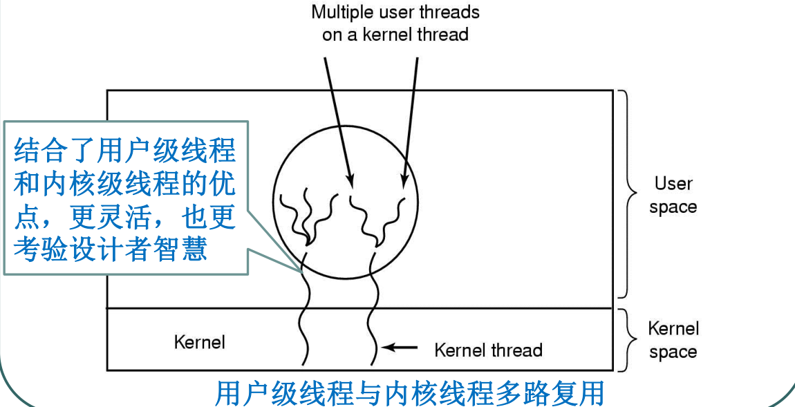

# 1、进程的基本概念、进程的顺序执行与并发执行特点；
进程是资源分配的基本单位.

进程控制块(pcb)描述进程的基本信息和运行状态,创建进程和撤销进程,都是指对PCB的操作.

顺序执行特征:

- 顺序性
- 封闭性 
- 可再现性

并发: 两个或者多个事件在**在同一个时间间隔**之内同时发生

并发执行特征:

- 间断性  任务完成具有执行 -> 暂停 -> 执行
- 失去封闭性  资源的状态由多个程序改变
- 未必可再现

# 2、线程的基本概念
线程是独立调度的基本单位.

一个进程里面可以有多个线程,他们共享进程资源.
# 3、进程与程序、进程与线程的区别与联系；

进程与程序的区别及联系
- 进程是动态的, 而程序是静态的
- 进程可以并发, 而程序则没有
- 进程是资源竞争的基本单位

联系: 一个程序可以生成多个不同的进程
## 1,拥有资源
进程是资源分配的基本单位,但是线程不拥有资源,进程的线程可以访问该进程的资源,

## 2,调度
线程是独立调度的基本单位,在同一进程中,线程的切换不会引起进程切换,但是从一个进程的线程切换到
另外一个进程的线程时,就会引起进程切换.即跨进程.

## 3.系统开销
创建或者销毁进程时,系统都要为之分配或者回收资源, 例如内存空间, i/o设备,需要付出的代价远
大于创建或者撤销线程时的开销.同样的,在进行进程切换时,设计当前执行进程CPU环境的保存及新调度
进程CPU环境的设置,而线程切换时只需保存和设置少数寄存器,开销小.
## 4.通信方面
线程间可以直接读写同一进程的数据进行通信,但是进程间通信需要IPC
# 4、进程的实现、线程的实现；
## 线程的实现
- 在用户空间中实现线程

优点:

内核对线程包一无所知,可以在不支持线程的操作系统中实现多线程编程

效率高,调度速度快

允许每个进程有自己定制的调度算法

具有良好的可拓展性, 无需内核空间支持

缺点:

实现阻塞系统调用困难

缺页问题带来效率降低

易出现线程永久运行问题

对于CPU繁忙型应用不利
- 在内核中实现线程

与用户级线程区别:

当一个线程阻塞时, 在内核线程系统中可以运行同一个进程中的另一个线程或者另外一个进程的线程

而在用户线程系统中只能运行自己进程的线程,除非该进程被内核剥夺CPU(或者没有可运行的线程存在)

内核线程系统中创建或者终止线程代价比较大,而用户线程系统代价小

在阻塞系统调用和处理缺页问题方面,内核线程系统更有优势

- 混合实现方式

结合两者优点,更加灵活

# 5、进程的基本状态及其转换；

- 就绪态(ready):等待被调度
- 运行态(running): 
- 阻塞态(waiting): 等待资源

注意事项:

只有就绪态和运行态可以相互转换,其他的都是单向转换.

就绪态的进程通过调度算法从而获得cpu时间,转而为运行态

运行态的进程,在使用完cpu的时间片后转为就绪态,等待下次调度

阻塞态是缺少需要的资源从而由运行态转换而来,但是这个资源不包括cpu时间

缺少cpu时间会从运行态转成就绪态
# 6、临界资源、临界区、进程的同步与互斥概念；进程的同步与互斥信号量实现；
临界资源: 一次只允许一个进程使用的软硬件资源

临界区: 在每个进程中,访问临界资源的那部分代码

同步: 多个线程因为合作产生的直接制约关系,使得进程有一定的先后顺序  

互斥: 多个进程在同一时刻只有一个进程能进入临界区

信号量是一个整形变量, 可以对其执行down和up操作,即P和V操作
- down (P): 如果信号量大于0,执行-1操作;如果信号量等于0,进程睡眠,等待信号量大于0

- up (V); 对信号量执行+1操作,唤醒睡眠的进程让其完成down操作

down和up被设计成原语,不可分割,通常的做法是在执行这些操作的时候屏蔽中断

如果信号量的取值只能设为0或者1,那么就成为了互斥量,0代表临界区已经加锁,1代表临界区解锁

# 7、作业的状态、常见的作业及进程调度算法；
## 进程调度算法
不同环境的调度算法目标不同,因此需要针对不同的环境来讨论算法.

### 1.批处理系统
批处理系统没有太多的用户操作,在该系统中,调度算法目标是保证吞吐量和周转时间(从提交到终止时间)

### 1.1 先来先服务 FCFS
非抢占式的调度算法,按照请求顺序进行调度

有利于长作业,但不利于短作业,因为短作业必须等待前面长作业执行完毕才能执行,而长作业又要执行很久,
造成短作业等待时间过长.

### 1.2 短作业优先 SJF

非抢占式的调度算法,按估计运行的最短时间来进行调度

长作业可能会饿死,处于一直等待短作业执行完毕的状态.因为只要有短作业的存在,
那么长作业就一直得不到调度

### 1.3 最短剩余时间优先

最短作业优先的抢占式版本,按剩余运行时间的顺序进行调度.当一个新的作业到达时,其整个运行时间与
当前进程的剩余时间作比较.如果新的进程需要的时间更少,则挂起当前进程,运行新进程.否则新进程等待.

### 2. 交互式系统

交互式系统有大量的用户操作,在该系统中调度算法的目标是快速响应.

### 2.1 时间片轮转

将所有就绪进程按FCFS的原则排成一个队列,每次调度时,把CPU时间分配给队首进程,该进程可以执行一个时间片
.当时间片用完时,由计时器发出时钟中断,调度程序便停止该程序的执行,并将它送往就绪队列的末尾,同时
继续把CPU时间分配给队首的进程.

时间片轮转算法的效率和时间片的大小有很大关系:

- 因为进程切换都要保存进程的信息并且载入新进程的信息,如果时间片,会导致进程切换得太频繁,在进程切换上会花很多时间
- 而如果时间片过长,那么实时性就不能得到保证

### 2.2 优先级调度

为每一个进程分配一个优先级,按照优先级调度

为了防止低优先级永远等不到调度, 可以随着时间的推移增加等待进程的优先级.

### 2.3 多级反馈队列
一个进程需要执行100个时间片,如果采用时间片轮转调度算法,那么需要交换100次.

多级队列是为这种需要连续执行多个时间片的进程考虑,它设置了多个队列, 每个队列时间片都大小不同, 
例如1,2,4,8... 进程在第一个队列没执行完,就会被移到下一个队列.这种方式下,之前的进程只需要交换7次.

每个队列优先级也不同, 最上面的优先级最高.因此只有上一个队列没有进程排队,才能调度当前队列上的进程.

可以将这种调度算法看成是**时间片轮转调度算法**和**优先级调度算法**结合

### 3. 实时系统

实时系统要求一个请求在一个确定时间内得到响应.
分为硬实时和软实时,前者必须满足绝对的截至时间,后者可以容忍一定的超时.

# 其他补充

原语: 系统中某些具有特定功能的程序段

一类时机器指令级,其特点时执行期间不允中断

另一类是功能级原语,其特点是作为原语的程序段不允许并发执行