# I/O设备与系统的交互方式、

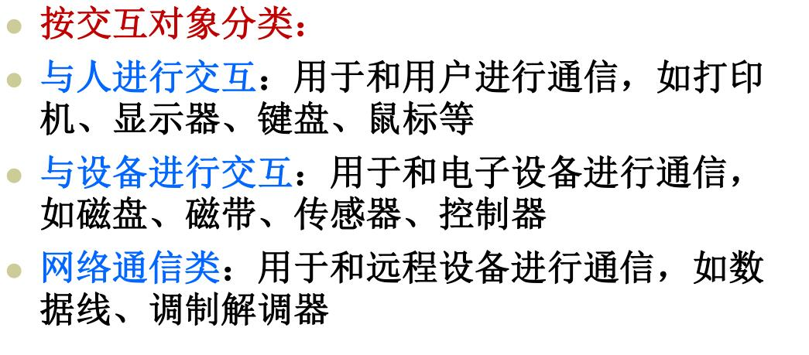

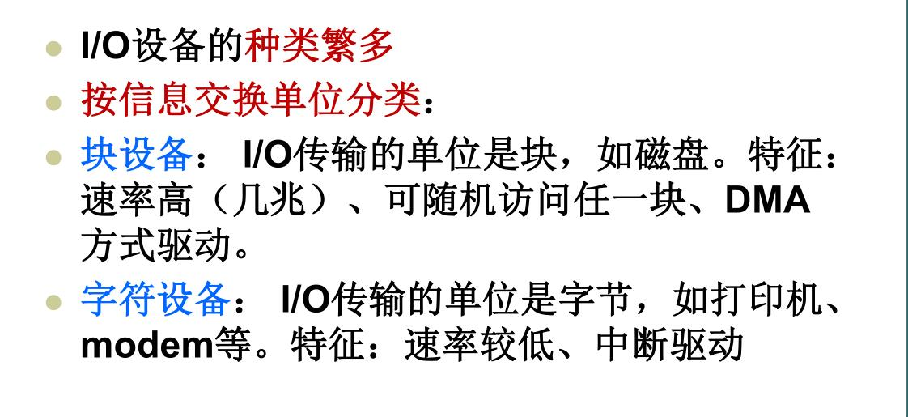

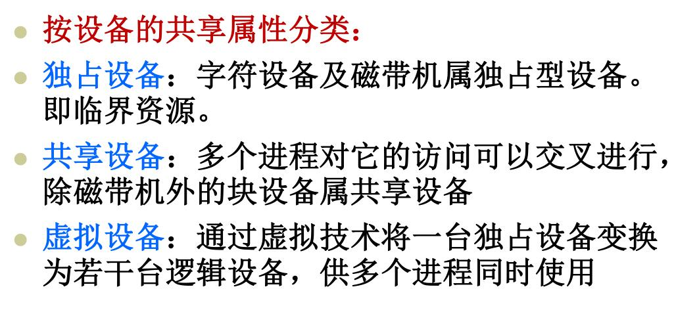

# I/O统一编址与I/O独立编址

# I/O设备独立性

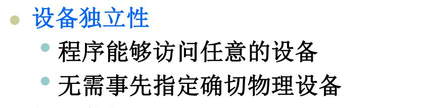
# 2、常用I/O数据传送方式；

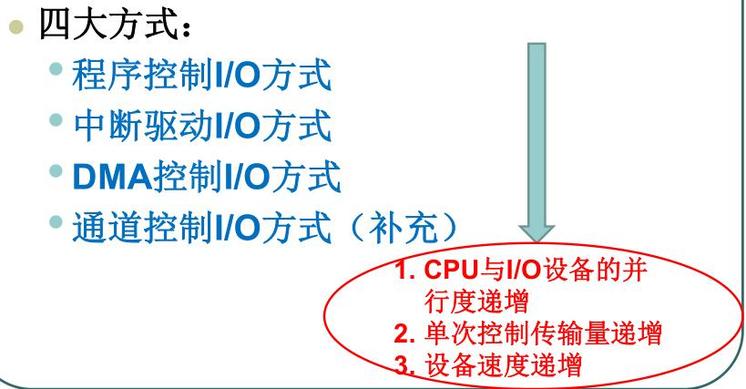

程序控制I/O

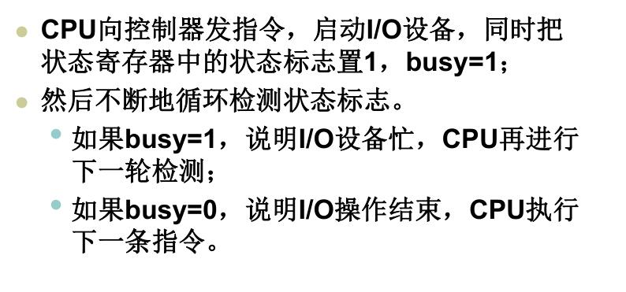

缺点: 以字(节)为数据交换单位, CPU忙等待I/O设备

中断驱动I/O

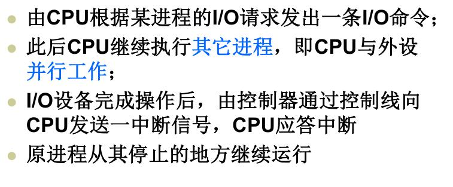

优缺点

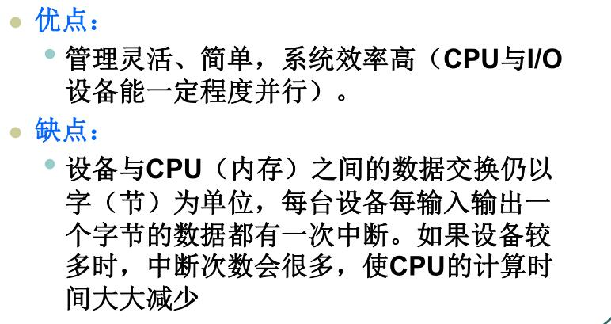

DMA控制方式

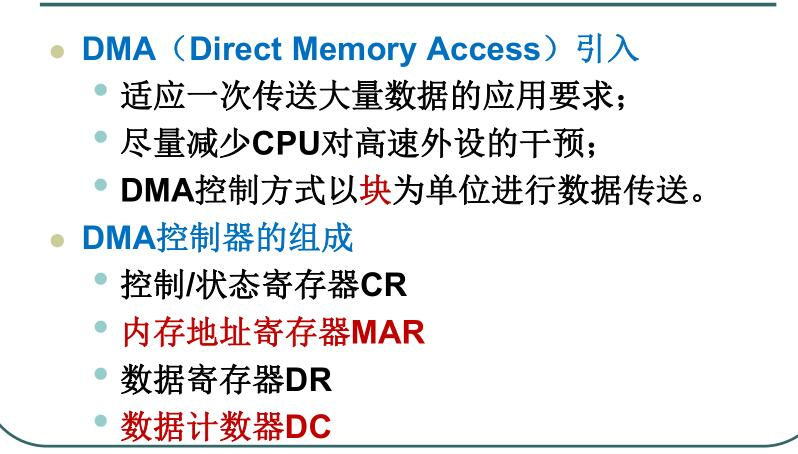

通道控制

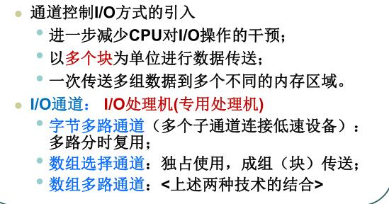

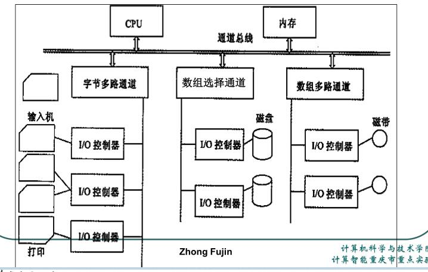

 吧v给                  

# 3、Spooling系统

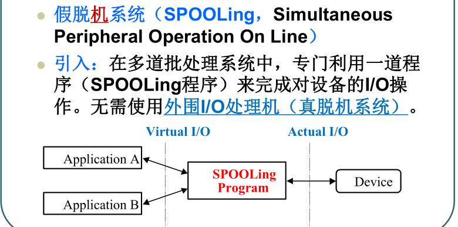

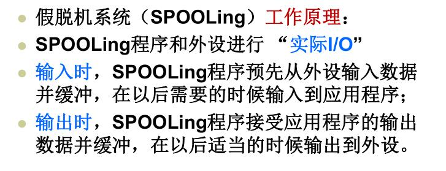

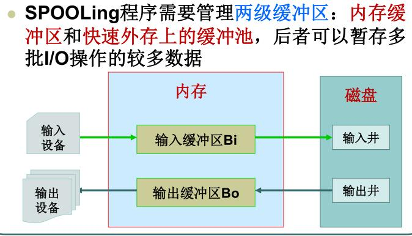

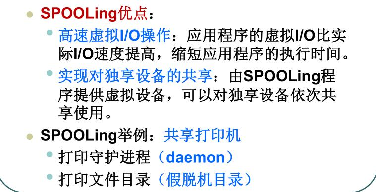

**# 4、I/O软件的分层结构及其功能**
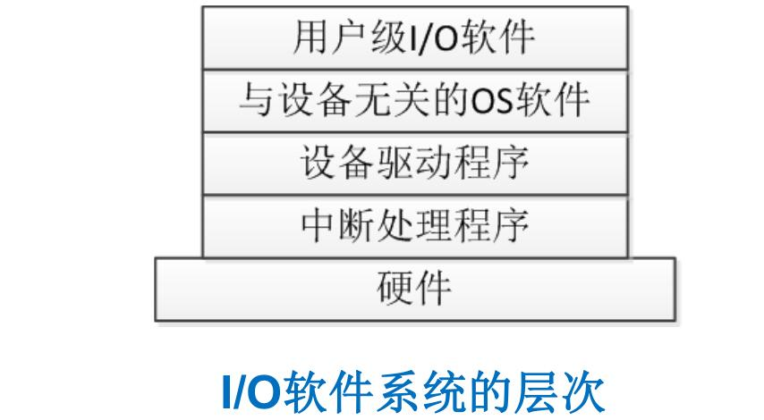
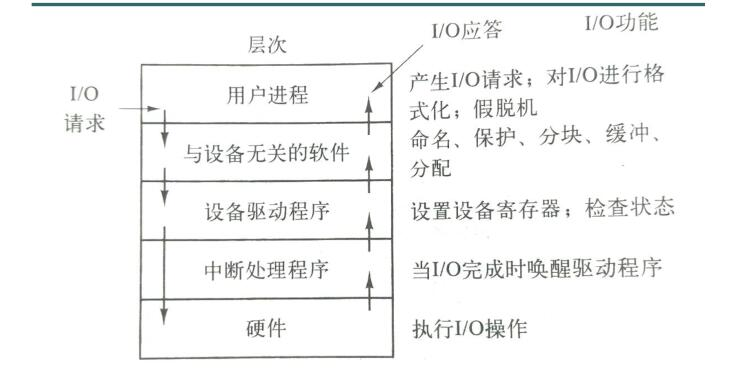

   - 用户层： 进行I/O调用；格式化I/O，spooling
   - 设备无关软件：命名，保护，阻塞，缓冲，分配
   - 设备驱动程序：建立设备寄存器；检查设备状态
   - 中断处理程序：当I/O结束时，唤醒驱动程序
# 5、磁盘设备读写工作原理
?啥原理
# 6、常用磁盘臂调度算法
没啥好总结的