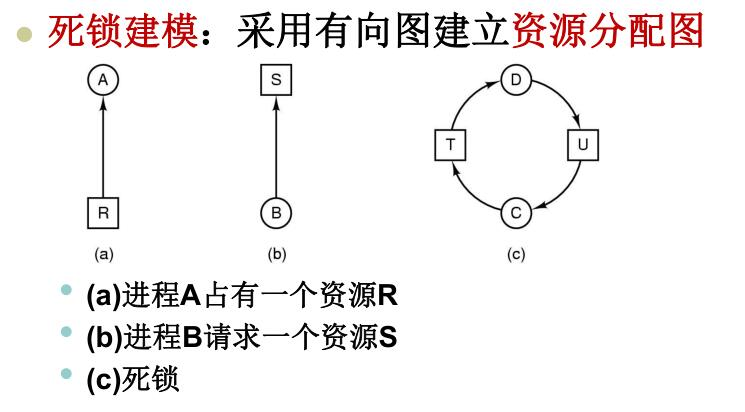

# 1、死锁的概念、死锁产生的原因及必要条件、死锁问题的解决策略

## 死锁定义:

如果一个进程集合中的每一个进程都在等待只能由**该进程集合**的其他进程才能引发的**事件**,
那么, 该进程集合是死锁的.

## 死锁产生原因

## 必要条件

- 互斥: 每个资源要么已经分配给了一个进程, 要么就是可用的
- 占有和等待: 已经得到了某个资源的进程可以再请求新的资源
- 不可抢占: 已经分配给一个进程的资源不能强制地被抢占, 它只能被占用它的进程显示地释放
- 环路等待: 有两个或者两个以上的进程组成一条环路, 该环路中的每个进程都在等待下一个进程所占有的资源

## 死锁问题的解决策略

- 鸵鸟策略(忽略该问题)
- 检测死锁并恢复(解除死锁)
- 仔细对资源进行分配, 动态地避免死锁
- 通过破坏引起死锁的四个必要条件之一,防止(预防)死锁产生

### 鸵鸟算法

把头埋在沙子里，假装根本没发生问题。

因为解决死锁问题的代价很高，因此鸵鸟策略这种不采取任务措施的方案会获得更高的性能。

当发生死锁时不会对用户造成多大影响，或发生死锁的概率很低，可以采用鸵鸟策略。

大多数操作系统，包括 Unix，Linux 和 Windows，处理死锁问题的办法仅仅是忽略它。

### 检测死锁并恢复(解除死锁)

不试图阻止死锁, 而是当检测到死锁发生时, 采取措施进行恢复.

1. 每种类型一个资源的死锁检验

每种类型一个资源的死锁检测算法是通过检测有向图是否存在环来实现的, 从一个节点出发进行深度优先搜索, 对访问过的节点进行标记, 
如果访问了已经标记的节点, 就表示有向图存在环, 也就是检测到死锁的发生.

2. 每种类型多个资源的死锁检测

上图中, 有三个进程四个资源, 每个数据代表的意义如下:

- E向量; 资源总量
- A向量; 资源剩余量
- C矩阵; 每个进程所拥有的资源数量, 每一行都代表一个进程拥有资源的数量
- R矩阵; 每个进程请求的资源数量

P3请求成功, 释放资源. 此时A = (2 2 2 0). P2可以执行, 释放P2后, A = (4 2 2 1)
P1也可以执行.所有进程都执行, 没有死锁.

算法总结:

每个进程最开始时都不被标记, 执行过程有可能被标记, 当算法结束时, 任何没有被标记的进程都是死锁进程.

1. 寻找一个没有被标记的进程Pi, 它所请求的资源小于等于A

2. 如果找到了这样一个进程, 那么将C 矩阵的第i行向量加到A中, 标记该进程, 转回1.

3. 如果没有这样一个进程, 算法终止

3. 死锁恢复
- 利用抢占恢复
- 利用回滚恢复
- 通过杀死进程恢复

### 死锁预防
在程序运行之前预防发生死锁

1. 破坏互斥条件

2. 破坏占有和等待条件

一种实现方式是规定所有进程在开始执行前请求所需要的全部资源.

3. 破坏不可抢占条件

4. 破坏环路等待

给资源同一编码, 进程只能通过编号顺序来请求资源

# 死锁避免

在程序运行时避免发生死锁

## 安全状态的定义、

如果没有死锁发生, 并且即使所有进程突然请求对资源的最大请求, 也仍然存在某种调度

次序能使得每一个进程运行完毕, 则称该状态是安全的.

银行家算法；

上图中有五个进程，四个资源。左边的图表示已经分配的资源，右边的图表示还需要分配的资源。

最右边的 E、P 以及 A 分别表示：总资源、已分配资源以及可用资源，注意这三个为向量，而不是具体数值，

例如 A=(1020)，表示 4 个资源分别还剩下 1/0/2/0。

- 查找右边的矩阵是否存在一行小于等于向量A. 如果不存在这样的行, 那么系统会发生死锁, 状态不安全

- 假若找到这样一行, 将该进程标记为终止, 并将其已分配资源加入A中

- 重复以上两步, 直到所有进程都标记为终止, 则状态是安全的.

