#1、文件的逻辑结构、物理结构、文件FCB

# 文件的逻辑结构

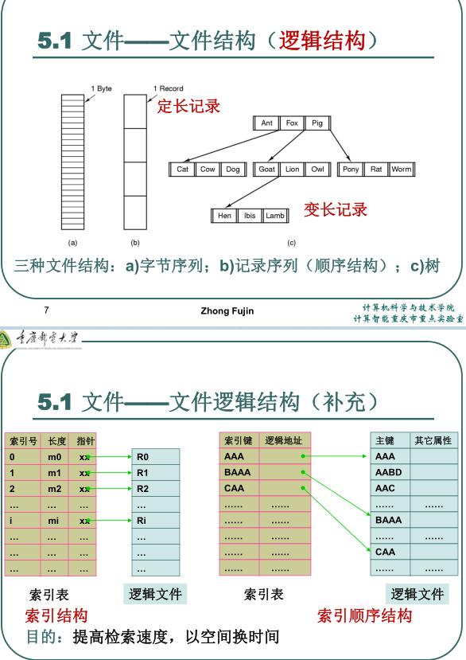

# 物理结构

# 文件FCB

# 文件的目录结构

单级目录结构

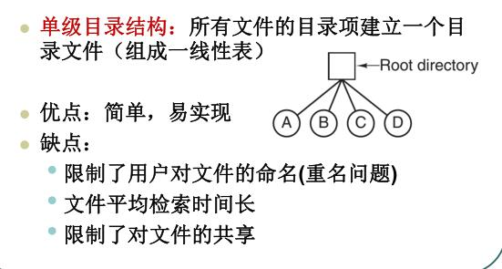

两级目录结构

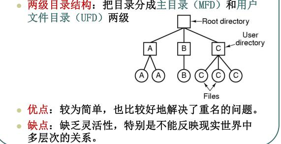

多级(层次或者树形)目录结构

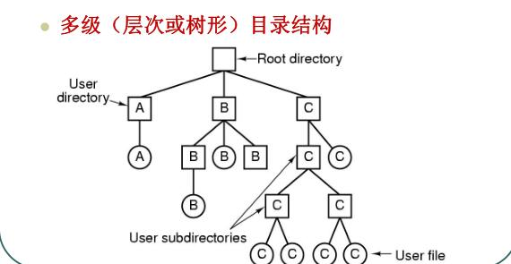

# 文件路径

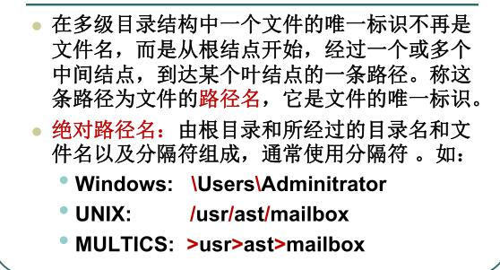

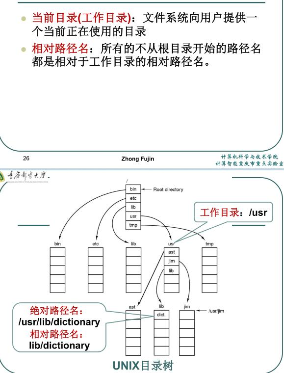

linux/unix 相关

# 文件的共享方式

## 通过目录项中的存储地址直接连接共享文件

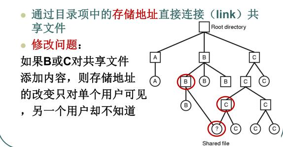

为什么不知道呢

## 通过连接i节点共享文件

## 通过符号链接

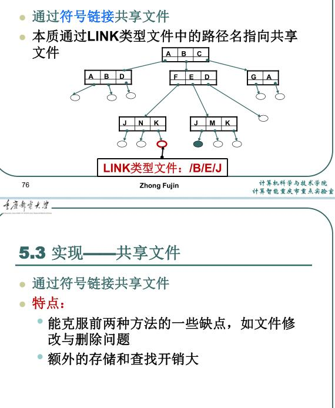

# 3、文件的磁盘空间管理方式

# 4、文件系统的可靠性

1. 文件系统备份:

2. 文件系统的一致性: 

# 5、文件系统的性能

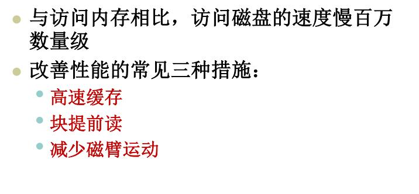

## 高速缓存

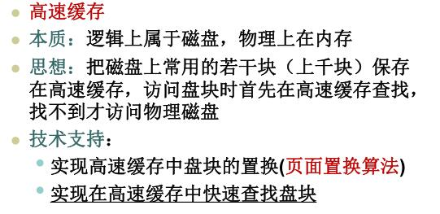

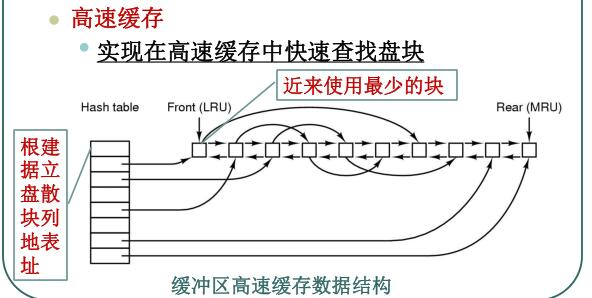

## 块提前读

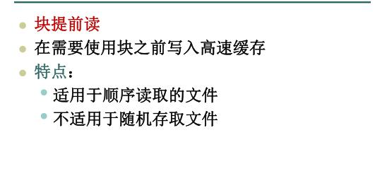

## 减少磁臂运动

# 6、文件的存取访问过程