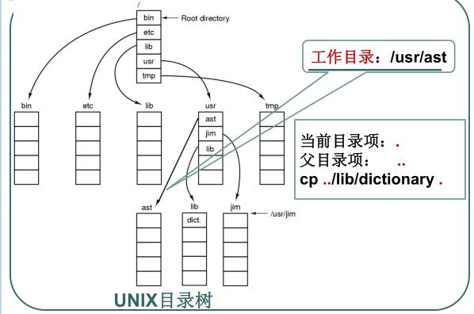
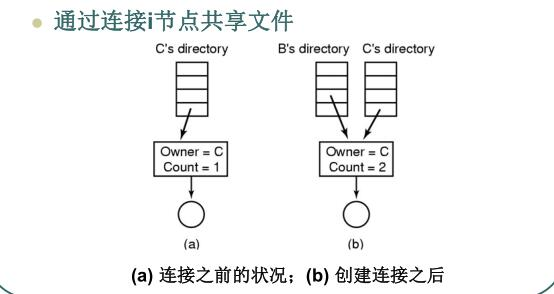

# 1、文件的逻辑结构、物理结构、文件FCB

# 文件的逻辑结构

- 字节序列
- 记录序列
- 树

# 物理结构

* 连续分配 -------> 顺序式文件结构

* 链接分配 -------> 连接式文件结构

* 索引分配 -------> 索引式文件结构

# 文件FCB

# 文件的目录结构

单级目录结构

两级目录结构

多级(层次或者树形)目录结构

**多级文件目录能够解决文件重名问题, 提高文件的搜素效率**

# 文件路径

linux/unix 相关

# 文件的共享方式

## 通过目录项中的存储地址直接连接共享文件

为什么不知道呢

## 通过连接i节点共享文件

## 通过符号链接

# 3、文件的磁盘空间管理方式

**# 4、文件系统的可靠性**

1. 文件系统备份:

2. 文件系统的一致性: 

# 5、文件系统的性能

## 高速缓存

## 块提前读

## 减少磁臂运动

**# 6、文件的存取访问过程**

什么是访问控制表? 什么是访问权限表?

两者是实现文件安全性的两个基本数据结构

- 将访问矩阵按列进行划分, 让每一列建立一个控制表, 即可得到各个对象的访问控制表
- 将访问矩阵按行进行划分, 让每一行建立一个访问权限表, 即可得到各个域的访问权限表